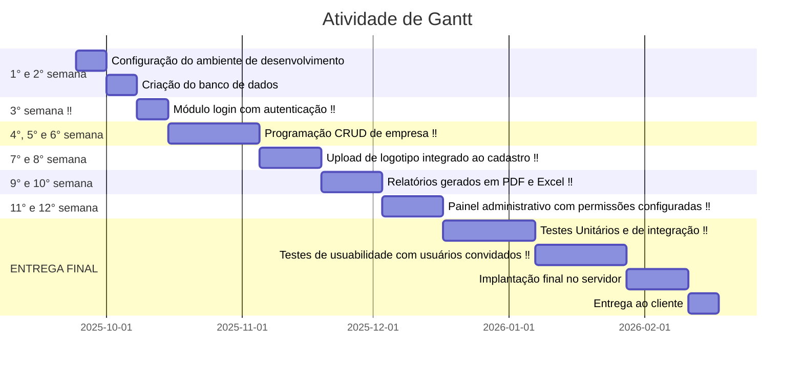
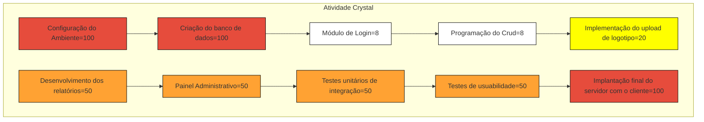

# atv-gaps-1

Resolução da atividade avaliativa de Gestão Ágil de Projetos

```mermaid
gantt
  title Atividade de Gantt
  dateFormat YYYY-MM-DD
  section 1° e 2° semana
    Configuração do ambiente de desenvolvimento: a1, 2025-09-24, 7d
    Criação do banco de dados: a2, after a1, 7d
  section 3° semana ‼️
    Módulo login com autenticação ‼️: a3, after a2, 7d
  section 4°, 5° e 6° semana 
    Programação CRUD de empresa ‼️: a4, after a3, 21d
  section 7° e 8° semana
    Upload de logotipo integrado ao cadastro ‼️: a5, after a4, 14d
  section 9° e 10° semana
    Relatórios gerados em PDF e Excel ‼️: a6, after a5, 14d
  section 11° e 12° semana
    Painel administrativo com permissões configuradas ‼️: a7, after a6, 14d
  section ENTREGA FINAL
    Testes Unitários e de integração ‼️: a8, after a7, 21d
    Testes de usuabilidade com usuários convidados ‼️: a9, after a8, 21d
    Implantação final no servidor: a10, after a9,  14d
    Entrega ao cliente: a11, after a10, 7d
```

```mermaid
graph TD
  subgraph Atividade Crystal
A1["Configuração do Ambiente=100"]:::vermelho --> A2["Criação do banco de dados=100"]:::vermelho --> A3["Módulo de Login=8"]:::branco --> A4["Programação do Crud=8"]:::branco --> A5["Implementação do upload de logotipo=20"]:::amarelo
B1["Desenvolvimento dos relatórios=50"]:::laranja --> B2["Painel Administrativo=50"]:::laranja --> B3["Testes unitários de integração=50"]:::laranja --> B4["Testes de usuabilidade=50"]:::laranja --> B5["Implantação final do servidor com o cliente=100"]:::vermelho
  end

classDef branco fill:#fff, stroke:#000, stroke-width:1px;
classDef amarelo fill:#FFFF00, stroke:#000000, stroke-width:1px;
classDef laranja fill:#FFA233, stroke:#000, stroke-width:1px;
classDef vermelho fill:#E64C3C, stroke:#000, stroke-width:1px;
```
